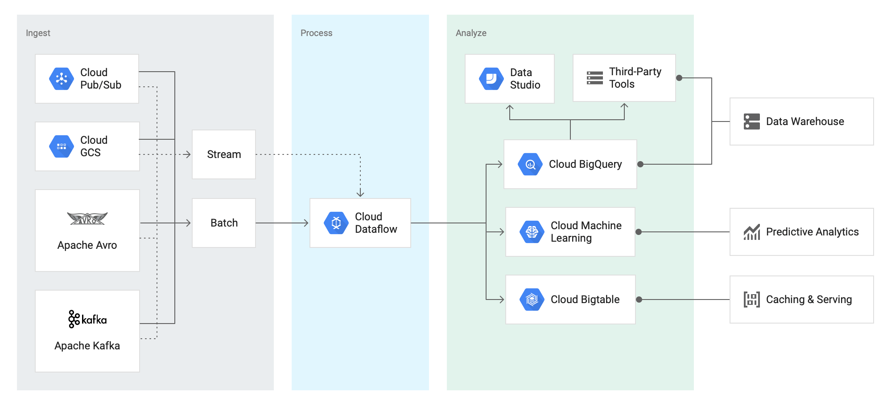

# beam-examples

A set of example **Streaming** and **Batch** jobs implementation with **Apache Beam**

`Dataflow brings life to Datalakes` 

  

### Features
1. Monorepo(apps, libs) project to showcase workspace setup with multiple apps and shared libraries
2. **Polyglot** - Support multiple languages (java, kotlin)
3. Support multiple testing frameworks (spek, kotlin-test and junit5) 
4. Support making `FatJar` for submitting  jobs form CI Environment 
5. Build **lightweight** Docker and [OCI](https://github.com/opencontainers/image-spec) images with [Jib](https://github.com/GoogleContainerTools/jib)
6. Build native binaries using [GraalVM](https://www.graalvm.org/)
7. Cloud Native (Run Local, Run on Cloud, Deploy as Template for GCD)
8. Multiple Runtime (Flink, Spark, Google Cloud Dataflow, Hazelcast Jet ) 

### Prerequisites
> see [PLAYBOOK](docs/PLAYBOOK.md)

### Quick Start

Run WordCount kotlin example:

    gradle :apps:wordcount:run --args="--runner=DirectRunner --inputFile=./src/test/resources/data/input.txt --output=./build/output.txt"

WordCount pipeline will run on local and produce the output file in `apps/wordcount/build` directory.

WordCount pipeline can run on Google Cloud Dataflow if you have a project setup in your local. 

    PROJECT_ID=<my-project-id>
    GCS_BUCKET=<my-project-gcs-bucket>
    export GOOGLE_APPLICATION_CREDENTIALS=<full-path-to-your-json>
    
    gradle :apps:wordcount:run --args="--runner=DataflowRunner --project=$PROJECT_ID --gcpTempLocation=gs://$GCS_BUCKET/dataflow/wordcount/temp/ --stagingLocation=gs://$GCS_BUCKET/dataflow/wordcount/staging/ --inputFile=gs://$GCS_BUCKET/dataflow/wordcount/input/shakespeare.txt --output=gs://$GCS_BUCKET/dataflow/wordcount/output/output.txt"

The `inputFile` option is defined by default in WordCount options, so that it will run with the input file and produce output files in <gs://your-cloud-storage-bucket>

### Reference 

1. [Apache Beam Programming Guide](https://beam.apache.org/documentation/programming-guide/)
1. https://github.com/xmlking/micro-apps
2. https://github.com/sfeir-open-source/kbeam
3. https://github.com/thinhha/gcp-data-project-template
4. https://google.github.io/flogger/best_practice
5. https://github.com/apache/beam/tree/master/examples/kotlin